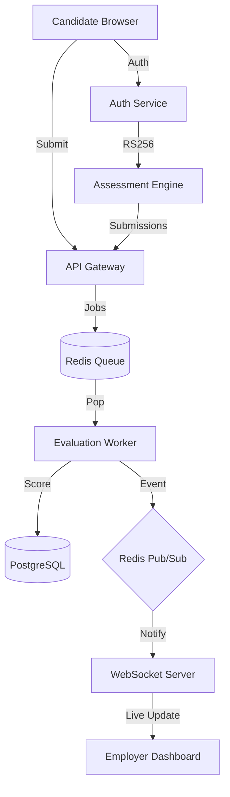

# Zetheta: Distributed Task Evaluation Platform

Zetheta is a high-performance, microservice-based platform designed to handle large-scale recruitment assessments with real-time feedback loops.

## 🏗️ Architecture



## 🚀 Features
- **Decoupled Microservices:** Independent services for Authentication, API Gateway, Evaluation, and Real-time messaging.
- **Asynchronous Processing:** Evaluation work is handled by a background worker pipeline with BullMQ.
- **Secure Handoff:** RS256 JWT-based cross-app authentication between the main portal and the specialized assessment engine.
- **Real-time Monitoring:** Live Dashboards for employers using WebSockets and Redis Pub/Sub.
- **Observability:** Centralized JSON logging and Prometheus metrics.

## 🛠️ Tech Stack
- **Frameworks:** Next.js 14, Fastify
- **Database:** PostgreSQL (Prisma ORM)
- **Messaging:** Redis, BullMQ
- **Ops:** Docker, TypeScript, Pino, prom-client
- **Styling:** TailwindCSS, Lucide icons

## 🚦 Getting Started

### Prerequisites
- Docker & Docker Compose
- Node.js 20+ (for local development)

### One-Step Setup
The entire stack can be launched with a single command:
```bash
docker compose up -d --build
```
This will:
1. Initialize the **PostgreSQL** database and run migrations.
2. Seed the database with a default candidate and employer.
3. Start all **6 microservices/apps**.
4. Generate RSA keys for secure token signing.

## 🔗 Port Mapping
- **Candidate Portal:** http://localhost:4001
- **Employer Dashboard:** http://localhost:4003 (Login: `employer@example.com` / `password123`)
- **Assessment Engine:** http://localhost:4002
- **API Gateway:** http://localhost:3001
- **Auth Service:** http://localhost:3000
- **WebSocket Server:** http://localhost:3003

## 🧠 Design Decisions
1. **Bypass Internal Token:** We used an `engine_` prefix for tokens shared between the internal engine and the gateway to allow secure proxying without exposing candidate session keys directly.
2. **Idempotent Workers:** The evaluation worker uses submission IDs as job keys to prevent duplicate scoring of the same attempts.
3. **Standalone Static Export:** Dashboard apps are containerized using Next.js `standalone` mode to minimize image size and maximize startup speed in high-scale environments.

## 🧪 Testing
Run tests across the entire monorepo:
```bash
pnpm test
```
Individual service tests are available in their respective `src/*.test.ts` files.
