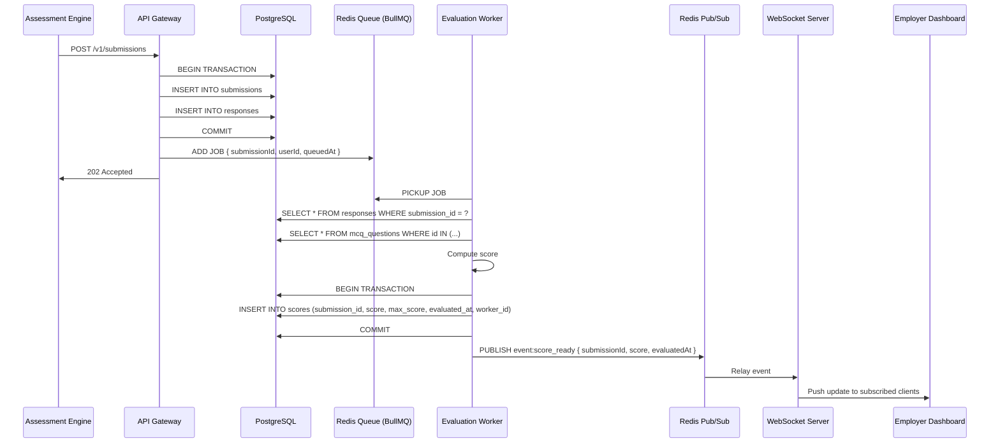

# Pipeline Design Document

## 1. Overview

This document describes the asynchronous evaluation pipeline responsible for processing candidate assessment submissions. The pipeline decouples answer submission from score computation, ensuring the API remains responsive under load while guaranteeing reliable, idempotent, and fault-tolerant scoring execution.

## 2. Architectural Goals

- **Non-blocking API**: Submission endpoints return immediately; scoring occurs in the background.
- **Idempotency**: Duplicate events must never produce duplicate score records.
- **Retry Safety**: Transient failures (database timeouts, network blips) trigger automatic retry.
- **Fault Tolerance**: Worker crashes, Redis downtime, and duplicate events are handled gracefully without data loss or inconsistency.
- **Observability**: Every job lifecycle event is logged and measured.

## 3. Technology Stack

| Component | Technology | Purpose |
|-----------|------------|---------|
| Message Broker | Redis | Durable job queue and event channel |
| Job Orchestrator | BullMQ | Job enqueueing, worker distribution, retries, and dead-letter handling |
| Database | PostgreSQL | Persistent storage for submissions, responses, and scores |
| Worker Runtime | Node.js / TypeScript | Score computation and result persistence |

## 4. End-to-End Flow

The following sequence diagram illustrates the complete submission-to-notification lifecycle:



## 5. Queue Design

### Job Structure

Each job carries only the identifiers required to reconstruct the evaluation context. Large payloads are intentionally avoided to minimize queue memory usage and serialization overhead.

```json
{
  "submissionId": "550e8400-e29b-41d4-a716-446655440000",
  "userId": "6ba7b810-9dad-11d1-80b4-00c04fd430c8",
  "queuedAt": "2025-04-16T12:34:56Z"
}
```

### Queue Configuration

| Property | Value | Rationale |
|----------|-------|-----------|
| Queue Name | `evaluation-queue` | Descriptive and service-scoped |
| Job ID | `submissionId` | Prevents duplicate jobs for the same submission |
| Max Attempts | 3 | Balances recovery with anomaly detection |
| Backoff Strategy | Exponential (`1s → 5s → 15s`) | Allows transient dependencies to recover |
| Remove on Complete | `true` | Keeps Redis memory footprint low |
| Remove on Fail | `false` | Preserves failed jobs for inspection |

## 6. Worker Implementation

### Processing Steps

1. **Receive**: Worker pulls a job from the queue.
2. **Deduplicate**: Query `scores` table by `submission_id`; if a record exists, acknowledge and skip.
3. **Fetch**: Retrieve all `responses` and corresponding `mcq_questions` from PostgreSQL.
4. **Compute**: Compare each response against the question's correct answer key and calculate the percentage score.
5. **Persist**: Insert the score record, including worker instance metadata for traceability.
6. **Notify**: Publish a `score:ready` event to Redis Pub/Sub.

### Pseudocode

```typescript
async function processEvaluationJob(job: Job<EvaluationPayload>) {
  const { submissionId } = job.data;
  const workerId = getWorkerInstanceId();

  // 1. Idempotency check
  const existingScore = await db.score.findUnique({
    where: { submissionId }
  });

  if (existingScore) {
    logger.info({ submissionId, workerId }, 'Score already exists; skipping duplicate job');
    return;
  }

  // 2. Fetch submission data
  const responses = await db.responses.findMany({
    where: { submissionId },
    include: { mcqQuestion: true }
  });

  if (responses.length === 0) {
    throw new Error(`No responses found for submission ${submissionId}`);
  }

  // 3. Compute score
  const { score, maxScore } = computeScore(responses);

  // 4. Persist result
  await db.score.create({
    data: {
      submissionId,
      score,
      maxScore,
      evaluatedAt: new Date(),
      workerId,
    }
  });

  // 5. Publish real-time event
  await redisPubSub.publish('score:ready', JSON.stringify({
    submissionId,
    score,
    maxScore,
    evaluatedAt: new Date().toISOString(),
  }));

  logger.info({ submissionId, score, workerId }, 'Evaluation completed successfully');
}
```

## 7. Idempotency Strategy

Idempotency is enforced through a three-layer defense:

1. **Queue-Level Deduplication**: BullMQ uses the `submissionId` as the job ID. Re-adding a job with the same ID is a no-op if the job is already pending or completed.
2. **Application-Level Pre-Check**: The worker queries the `scores` table before computation. If a score exists, the job exits cleanly.
3. **Database-Level Constraint**: A unique index on `scores(submission_id)` acts as the final guard against race-condition inserts.

### Outcome

- Duplicate enqueue operations are absorbed by the queue.
- Concurrent workers executing the same job cannot produce duplicate scores.
- Retries are safe at every stage of the pipeline.

## 8. Retry & Failure Handling

### Retry Behavior

BullMQ automatically retries jobs that throw retryable errors. The worker categorizes failures to determine whether a retry is appropriate:

| Failure Category | Examples | Action |
|------------------|----------|--------|
| Transient | Database timeout, Redis connection reset, network partition | Retry with exponential backoff |
| Permanent | Invalid submission ID, missing responses, data integrity violation | Log and fail immediately (no retry) |
| Worker Crash | Process termination, out-of-memory kill | BullMQ re-queues unacknowledged job |

### Dead-Letter Handling

Jobs that exhaust all retry attempts are moved to a `evaluation-queue:failed` set. A scheduled cleanup task archives these jobs to PostgreSQL for later analysis.

## 9. Fault Tolerance Scenarios

| Scenario | Impact | Mitigation |
|----------|--------|------------|
| **Worker Crash** | In-progress job is lost | BullMQ re-queues the job after the visibility timeout expires; another worker picks it up |
| **Duplicate Job** | Multiple workers attempt the same submission | Idempotency checks ensure only the first worker persists a score |
| **Redis Temporary Failure** | New jobs cannot be enqueued | API Gateway queues submissions in a local in-memory buffer (bounded) and flushes to Redis on recovery |
| **Redis Permanent Failure** | Pipeline halts | API Gateway returns `202 Accepted` but falls back to synchronous polling for status; workers cannot run |
| **Database Failure** | Scores cannot be written | Transaction rollback + retry; permanent DB outage stalls workers but does not corrupt data |

### Graceful Redis Degradation

If Redis is unavailable when a candidate submits:

1. The API Gateway still commits the submission to PostgreSQL.
2. A local staging table (`pending_evaluations`) records the `submissionId`.
3. A background poller watches for Redis recovery and replays pending jobs.
4. The Assessment Engine polls `GET /v1/scores/:submissionId` as a fallback mechanism.

## 10. Performance & Scalability

- **API Latency**: The submission endpoint performs only two indexed writes (submissions, responses) and a lightweight Redis `LPUSH`, guaranteeing response times well under the `200 ms` p95 target.
- **Horizontal Worker Scaling**: Evaluation Workers are stateless. Running multiple instances behind the same queue increases throughput linearly.
- **Database Efficiency**: All worker queries leverage indexed columns (`submission_id`, `question_id`) to avoid full table scans.
- **Queue Memory**: Minimal job payloads keep Redis memory usage low even under high load.

## 11. Observability

### Metrics

- `pipeline_job_queued_total`: Counter of jobs added to the queue.
- `pipeline_job_completed_total`: Counter of successfully processed jobs.
- `pipeline_job_failed_total`: Counter of permanently failed jobs.
- `pipeline_job_duration_seconds`: Histogram of end-to-end evaluation time.
- `pipeline_job_retries_total`: Counter of retry attempts.

### Logging

Every job emits structured log events at key lifecycle stages:

```json
{
  "level": "info",
  "service": "evaluation-worker",
  "event": "evaluation_completed",
  "submissionId": "uuid",
  "workerId": "worker-1",
  "score": 85,
  "durationMs": 45
}
```

## 12. Conclusion

The evaluation pipeline is designed for reliability under real-world distributed conditions. By combining BullMQ's robust queue semantics with application-level idempotency and database constraints, the system guarantees exactly-once scoring semantics, graceful failure recovery, and horizontal scalability.
