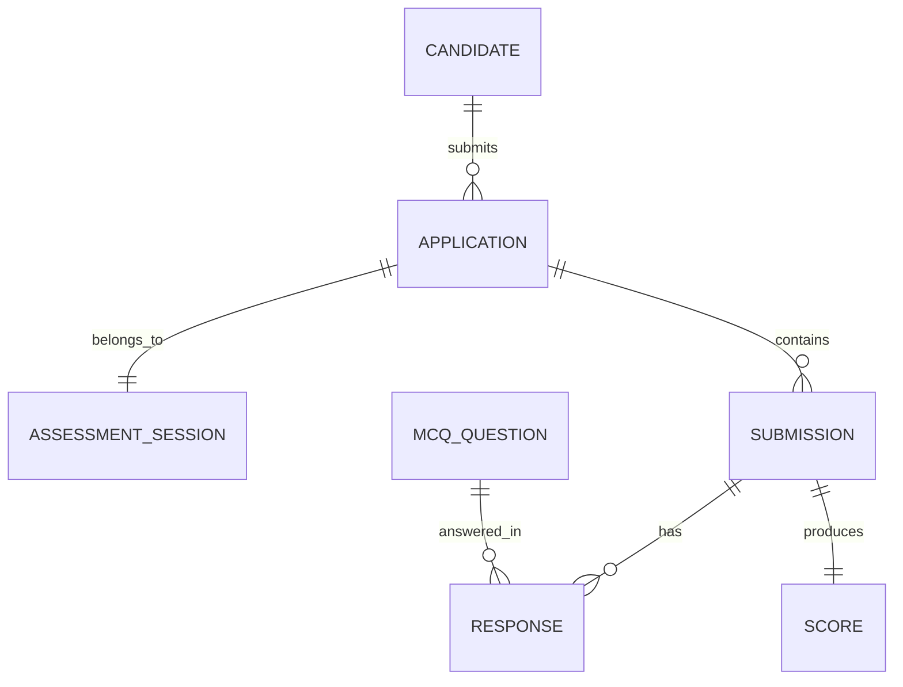

# Database Schema Design Document

## 1. Overview

This document defines the PostgreSQL relational schema for the distributed candidate evaluation platform. The schema is designed to support the full assessment lifecycle — from candidate registration and application to response collection, asynchronous scoring, and real-time dashboard reporting — while ensuring data integrity, query performance, and operational clarity.

## 2. Design Principles

- **Normalized Core Entities**: Candidate, application, question, response, and score data are stored in dedicated tables to minimize redundancy.
- **Referential Integrity**: Foreign key constraints enforce valid relationships and prevent orphaned records.
- **Index-First Design**: Every hot-path query is backed by a B-tree index to eliminate full table scans and maintain the `<200 ms` API latency target.
- **Auditability**: Key tables include `created_at` and `updated_at` timestamps for traceability.

## 3. Entity-Relationship Diagram

## 4. Table Specifications

### 4.1 `candidates`

Stores candidate identity and authentication credentials.

| Column | Type | Constraints | Description |
|--------|------|-------------|-------------|
| `id` | `UUID` | `PRIMARY KEY` | Stable candidate identifier |
| `email` | `VARCHAR(255)` | `UNIQUE, NOT NULL` | Login email address |
| `password_hash` | `VARCHAR(255)` | `NOT NULL` | Argon2 or bcrypt hash |
| `name` | `VARCHAR(255)` | `NOT NULL` | Full display name |
| `role_id` | `UUID` | `NOT NULL, FOREIGN KEY → roles(id)` | Assigned RBAC role |
| `created_at` | `TIMESTAMPTZ` | `DEFAULT NOW()` | Registration timestamp |
| `updated_at` | `TIMESTAMPTZ` | `DEFAULT NOW()` | Last update timestamp |

**Indexes:**
- `candidates_email_idx` on `email` — supports login lookups and uniqueness enforcement.
- `candidates_role_id_idx` on `role_id` — supports role-based filtering.

---

### 4.2 `roles`

Defines user roles for RBAC.

| Column | Type | Constraints | Description |
|--------|------|-------------|-------------|
| `id` | `UUID` | `PRIMARY KEY` | Role identifier |
| `name` | `VARCHAR(100)` | `UNIQUE, NOT NULL` | Role name (`candidate`, `employer`, `admin`) |
| `created_at` | `TIMESTAMPTZ` | `DEFAULT NOW()` | Creation timestamp |

---

### 4.3 `permissions`

Defines granular permissions.

| Column | Type | Constraints | Description |
|--------|------|-------------|-------------|
| `id` | `UUID` | `PRIMARY KEY` | Permission identifier |
| `name` | `VARCHAR(100)` | `UNIQUE, NOT NULL` | Permission slug (`read:dashboard`, `create:submission`) |
| `created_at` | `TIMESTAMPTZ` | `DEFAULT NOW()` | Creation timestamp |

---

### 4.4 `role_permissions`

Junction table mapping roles to permissions.

| Column | Type | Constraints | Description |
|--------|------|-------------|-------------|
| `role_id` | `UUID` | `PRIMARY KEY, FOREIGN KEY → roles(id)` | Role reference |
| `permission_id` | `UUID` | `PRIMARY KEY, FOREIGN KEY → permissions(id)` | Permission reference |

**Indexes:**
- `role_permissions_role_id_idx` on `role_id`.
- `role_permissions_permission_id_idx` on `permission_id`.

---

### 4.5 `applications`

Links candidates to assessment sessions and tracks their progression through the funnel.

| Column | Type | Constraints | Description |
|--------|------|-------------|-------------|
| `id` | `UUID` | `PRIMARY KEY` | Application identifier |
| `candidate_id` | `UUID` | `NOT NULL, FOREIGN KEY → candidates(id)` | Candidate reference |
| `status` | `VARCHAR(50)` | `NOT NULL, DEFAULT 'applied'` | Funnel status: `applied`, `attempted`, `evaluated` |
| `started_at` | `TIMESTAMPTZ` | `NULL` | Timestamp when assessment was started |
| `submitted_at` | `TIMESTAMPTZ` | `NULL` | Timestamp when assessment was submitted |
| `created_at` | `TIMESTAMPTZ` | `DEFAULT NOW()` | Application creation timestamp |
| `updated_at` | `TIMESTAMPTZ` | `DEFAULT NOW()` | Last update timestamp |

**Indexes:**
- `applications_candidate_id_idx` on `candidate_id` — candidate profile lookups.
- `applications_status_idx` on `status` — dashboard funnel filtering.
- `applications_candidate_status_idx` on `(candidate_id, status)` — combined candidate + status queries.

---

### 4.6 `assessment_sessions`

Defines a reusable assessment configuration (a container for questions).

| Column | Type | Constraints | Description |
|--------|------|-------------|-------------|
| `id` | `UUID` | `PRIMARY KEY` | Session identifier |
| `title` | `VARCHAR(255)` | `NOT NULL` | Assessment title |
| `description` | `TEXT` | `NULL` | Optional description |
| `time_limit_minutes` | `INTEGER` | `NULL` | Optional time constraint |
| `created_at` | `TIMESTAMPTZ` | `DEFAULT NOW()` | Creation timestamp |

---

### 4.7 `mcq_questions`

Stores multiple-choice questions and their correct answers.

| Column | Type | Constraints | Description |
|--------|------|-------------|-------------|
| `id` | `UUID` | `PRIMARY KEY` | Question identifier |
| `assessment_session_id` | `UUID` | `NOT NULL, FOREIGN KEY → assessment_sessions(id)` | Parent assessment |
| `sequence` | `INTEGER` | `NOT NULL` | Display order within the assessment |
| `question_text` | `TEXT` | `NOT NULL` | Question content |
| `options` | `JSONB` | `NOT NULL` | Array of options: `[{"label": "A", "text": "O(n)"}, ...]` |
| `correct_answer` | `VARCHAR(10)` | `NOT NULL` | Correct option label (e.g., `B`) |
| `created_at` | `TIMESTAMPTZ` | `DEFAULT NOW()` | Creation timestamp |

**Indexes:**
- `mcq_questions_assessment_session_id_idx` on `assessment_session_id` — question retrieval for a session.
- `mcq_questions_sequence_idx` on `sequence` — ordering support.

---

### 4.8 `submissions`

Represents a candidate's completed assessment submission.

| Column | Type | Constraints | Description |
|--------|------|-------------|-------------|
| `id` | `UUID` | `PRIMARY KEY` | Submission identifier |
| `application_id` | `UUID` | `NOT NULL, FOREIGN KEY → applications(id)` | Linked application |
| `submitted_at` | `TIMESTAMPTZ` | `DEFAULT NOW()` | Submission timestamp |
| `created_at` | `TIMESTAMPTZ` | `DEFAULT NOW()` | Record creation timestamp |

**Indexes:**
- `submissions_application_id_idx` on `application_id` — lookup by application.
- `submissions_submitted_at_idx` on `submitted_at` — time-range queries.

---

### 4.9 `responses`

Stores individual answers per question within a submission.

| Column | Type | Constraints | Description |
|--------|------|-------------|-------------|
| `id` | `UUID` | `PRIMARY KEY` | Response identifier |
| `submission_id` | `UUID` | `NOT NULL, FOREIGN KEY → submissions(id)` | Parent submission |
| `question_id` | `UUID` | `NOT NULL, FOREIGN KEY → mcq_questions(id)` | Answered question |
| `answer` | `VARCHAR(10)` | `NOT NULL` | Candidate's selected option label |
| `created_at` | `TIMESTAMPTZ` | `DEFAULT NOW()` | Response timestamp |

**Indexes:**
- `responses_submission_id_idx` on `submission_id` — worker fetches all responses for scoring.
- `responses_question_id_idx` on `question_id` — question-level analytics.
- `responses_submission_question_idx` on `(submission_id, question_id)` — uniqueness enforcement and optimized lookups.

**Constraints:**
- `UNIQUE (submission_id, question_id)` — prevents duplicate answers for the same question.

---

### 4.10 `scores`

Stores the computed evaluation result for a submission.

| Column | Type | Constraints | Description |
|--------|------|-------------|-------------|
| `id` | `UUID` | `PRIMARY KEY` | Score identifier |
| `submission_id` | `UUID` | `UNIQUE, NOT NULL, FOREIGN KEY → submissions(id)` | Linked submission |
| `score` | `INTEGER` | `NOT NULL` | Computed score |
| `max_score` | `INTEGER` | `NOT NULL` | Maximum possible score |
| `evaluated_at` | `TIMESTAMPTZ` | `DEFAULT NOW()` | Evaluation completion timestamp |
| `worker_id` | `VARCHAR(100)` | `NULL` | Identifier of the worker instance that processed the job |
| `created_at` | `TIMESTAMPTZ` | `DEFAULT NOW()` | Record creation timestamp |

**Indexes:**
- `scores_submission_id_idx` on `submission_id` — idempotency checks and dashboard joins.
- `scores_evaluated_at_idx` on `evaluated_at` — time-range filtering on dashboard.

**Constraints:**
- `UNIQUE (submission_id)` — core idempotency guarantee preventing duplicate scores.

## 5. Index Strategy Summary

| Table | Index | Purpose |
|-------|-------|---------|
| `candidates` | `email` | Login authentication |
| `applications` | `(candidate_id, status)` | Funnel aggregation & filtering |
| `mcq_questions` | `(assessment_session_id, sequence)` | Ordered question retrieval |
| `responses` | `(submission_id, question_id)` | Worker scoring & deduplication |
| `scores` | `submission_id` | Idempotency & result lookup |
| `scores` | `evaluated_at` | Dashboard time-range queries |

## 6. Data Integrity & Constraints

- **Foreign Keys**: All cross-table references enforce `ON DELETE RESTRICT` to prevent accidental data loss.
- **Unique Constraints**: `candidates(email)`, `scores(submission_id)`, and `responses(submission_id, question_id)` prevent duplication at the database level.
- **Check Constraints**: `score` and `max_score` should satisfy `score >= 0 AND score <= max_score`.

## 7. Query Performance Targets

All queries on the critical path (login, question fetch, submission, worker scoring, dashboard listing) are covered by the indexes above. No full table scans are performed on hot paths, ensuring API latency remains under the `200 ms` p95 target.

## 8. Conclusion

This schema provides a normalized, well-indexed, and integrity-enforced foundation for the evaluation platform. The design aligns with the assignment's data layer requirements and supports the asynchronous pipeline, real-time dashboard, and RBAC authorization model with optimal query performance.
