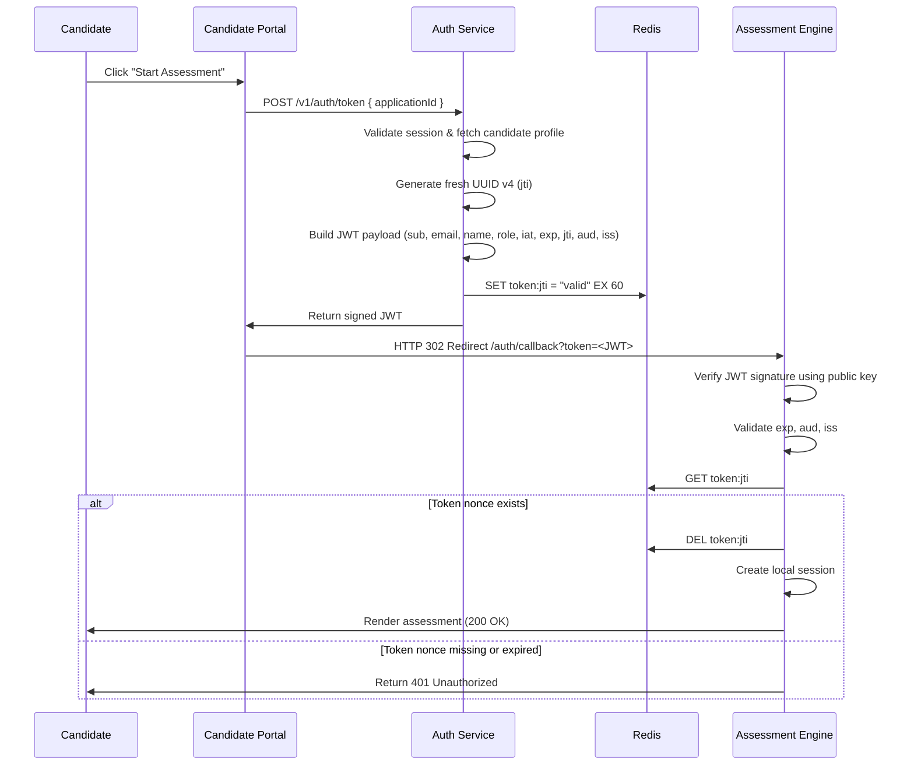

# Cross-Application Token Design Document

## 1. Objective

This document specifies the secure, stateless mechanism used to transfer authenticated candidate identity from the Candidate Portal to the Assessment Engine. The mechanism eliminates the need for re-authentication while satisfying strict security constraints: server-side generation, short expiration, single-use enforcement, cryptographic integrity, and replay-attack resistance.

## 2. Design Principles

- **Cryptographic Soundness**: Tokens are signed using the RS256 asymmetric algorithm, ensuring that only the Auth Service can create valid tokens while the Assessment Engine can verify them using a public key.
- **Minimal Trust Surface**: The token carries only the claims necessary for access decisions and is useless after its first consumption.
- **Fail-Closed Security**: Any validation failure — expired token, missing nonce, invalid signature, or reused token — results in immediate rejection.

## 3. Token Specification

### Format

Tokens are signed JSON Web Tokens (JWTs) conforming to [RFC 7519](https://datatracker.ietf.org/doc/html/rfc7519).

### Signing Algorithm

**RS256** (RSA with SHA-256) is the mandated algorithm.

- The **Auth Service** holds the **private key** and is the sole entity authorized to sign tokens.
- The **Assessment Engine** (and any other verifying service) holds the **public key** for signature verification.
- Key rotation is supported by updating the public key distributed to verifying services.

### Required Payload Claims

| Claim | Type | Description |
|-------|------|-------------|
| `sub` | `string` | Stable candidate identifier (UUID) |
| `email` | `string` | Candidate email address |
| `name` | `string` | Candidate display name |
| `role` | `string` | Candidate role (e.g., `candidate`) |
| `iat` | `number` | Issued-at timestamp (Unix seconds) |
| `exp` | `number` | Expiration timestamp (`iat + 60` seconds) |
| `jti` | `string` | Unique token identifier (UUID v4), freshly generated per request |
| `aud` | `string` | Audience claim: `assessment-engine` |
| `iss` | `string` | Issuer claim: `https://zetheta.com` |

### Example Payload

```json
{
  "sub": "550e8400-e29b-41d4-a716-446655440000",
  "email": "candidate@example.com",
  "name": "Jane Doe",
  "role": "candidate",
  "iat": 1713254400,
  "exp": 1713254460,
  "jti": "6ba7b810-9dad-11d1-80b4-00c04fd430c8",
  "aud": "assessment-engine",
  "iss": "https://zetheta.com"
}
```

## 4. End-to-End Flow

The following sequence diagram illustrates the complete cross-application handoff:



## 5. Single-Use Enforcement

JWTs are inherently stateless and, without additional controls, can be reused any number of times within their validity window. To enforce strict single-use semantics, the platform employs a Redis-backed nonce store keyed by the `jti` claim.

### Redis Operations

| Phase | Operation | Purpose |
|-------|-----------|---------|
| **Issuance** | `SET token:<jti> "valid" EX 60` | Registers the token as consumable for its lifetime |
| **Validation** | `GET token:<jti>` | Confirms the token has not yet been used |
| **Consumption** | `DEL token:<jti>` | Atomically invalidates the token after first use |

### Atomic Consumption

To prevent race conditions during concurrent validation attempts, the Assessment Engine performs the `GET` and `DEL` operations within a Redis transaction (or Lua script) where possible. If `GET` returns `nil`, the token is rejected as already consumed or expired.

## 6. Replay Attack Mitigation

A replay attack occurs when an attacker intercepts a valid token and attempts to reuse it. This design resists replay through four complementary controls:

1. **Unique Identifier (`jti`)**
   - Every token receives a cryptographically random UUID v4.
   - This enables fine-grained, server-side tracking of individual tokens.

2. **Single-Use Redis Nonce**
   - The `jti` must be present in Redis at the moment of validation.
   - Successful consumption deletes the nonce, rendering the token permanently invalid for subsequent requests.

3. **Short Expiry (`exp`)**
   - Tokens expire exactly 60 seconds after issuance.
   - This tightly bounds the window during which an intercepted token could theoretically be replayed.

4. **Audience and Issuer Validation (`aud`, `iss`)**
   - The Assessment Engine rejects tokens with an unexpected audience or issuer.
   - This prevents tokens intended for other services from being accepted.

## 7. Key Management

### Private Key (Auth Service)

- Stored in a secure file path **outside** the public web root.
- File permissions are restricted to the service user (`0600` or tighter).
- Loaded into memory at startup; never logged or transmitted.

### Public Key (Assessment Engine)

- Distributed to verifying services through a secure configuration mechanism (e.g., environment variable or secrets manager).
- Rotation requires updating the public key in all verifying services and generating a new private key on the Auth Service.

## 8. Validation Logic

The following pseudocode describes the complete token validation routine executed by the Assessment Engine:

```typescript
async function validateCrossAppToken(token: string): Promise<TokenPayload> {
  // 1. Cryptographic verification
  const payload = jwt.verify(token, publicKey, {
    algorithms: ['RS256'],
    audience: 'assessment-engine',
    issuer: 'https://zetheta.com',
    complete: false,
  }) as TokenPayload;

  // 2. Single-use nonce check
  const key = `token:${payload.jti}`;
  const exists = await redis.get(key);

  if (!exists) {
    throw new Error('Token has already been used or has expired');
  }

  // 3. Atomic invalidation
  await redis.del(key);

  return payload;
}
```

## 9. Failure Modes & Security Responses

| Failure Condition | Response | Rationale |
|-------------------|----------|-----------|
| Invalid signature | `401 Unauthorized` | Token was tampered with or signed by an untrusted party |
| Expired token (`exp`) | `401 Unauthorized` | Token lifetime has elapsed |
| Invalid `aud` or `iss` | `401 Unauthorized` | Token is scoped to a different service or issuer |
| Missing or reused `jti` | `401 Unauthorized` | Token has already been consumed or was never registered |
| Redis unavailable during validation | `503 Service Unavailable` | Fail-closed: cannot verify single-use status, so access is denied |

## 10. Comparison: HS256 vs RS256

While symmetric signing (HS256) offers simpler key management, this design explicitly selects **RS256** for the following reasons:

| Aspect | HS256 | RS256 (Selected) |
|--------|-------|------------------|
| Key Distribution | Shared secret must be distributed to all services | Only the public key is shared; private key remains isolated |
| Trust Model | All verifiers must be trusted with signing capability | Verifiers cannot forge tokens |
| Service Coupling | Tight coupling between auth and consuming services | Loose coupling; new services can verify without accessing secrets |
| Complexity | Lower setup overhead | Higher initial complexity, but manageable with standard libraries |

The Auth Service uses the `firebase/php-jwt` library (PHP) or `jsonwebtoken` (Node.js) with standard RSA key loading. The additional complexity is justified by the significantly reduced blast radius if a verifying service is compromised.

## 11. Security Properties Summary

| Property | Mechanism |
|----------|-----------|
| Server-generated | Private key is held exclusively by the Auth Service |
| Short-lived | Hard expiry of 60 seconds from issuance |
| Single-use | Redis `jti` nonce deleted atomically on first validation |
| Replay-resistant | Fresh `jti` per request + short TTL + immediate invalidation |
| Scoped | `aud` and `iss` claims restrict usage to the intended service |
| Cryptographically sound | RS256 asymmetric signatures prevent forgery |

## 12. Conclusion

This token design provides a secure, production-ready foundation for cross-application authentication. By combining RS256 cryptographic integrity with a short-lived, single-use Redis nonce mechanism, the system satisfies all assignment constraints while maintaining a low trust surface and clear operational boundaries between services.
