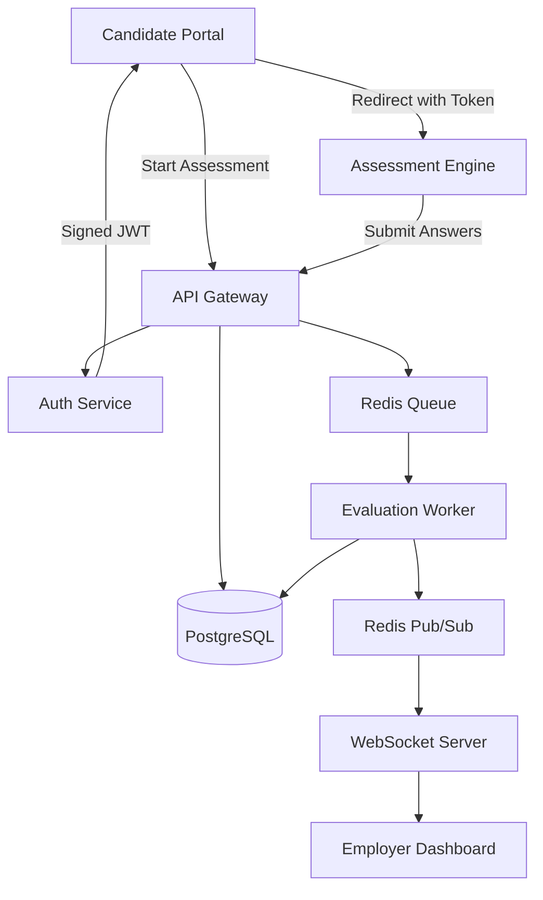
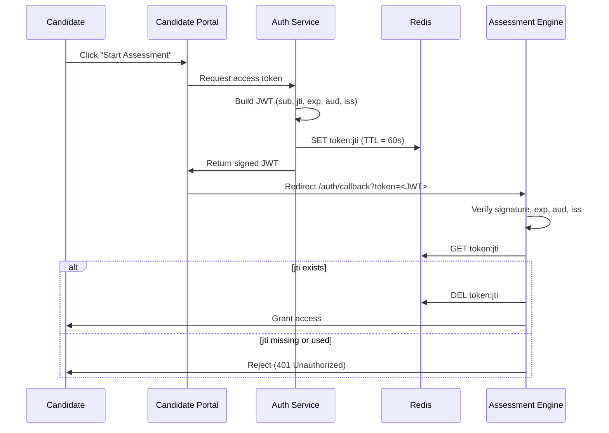
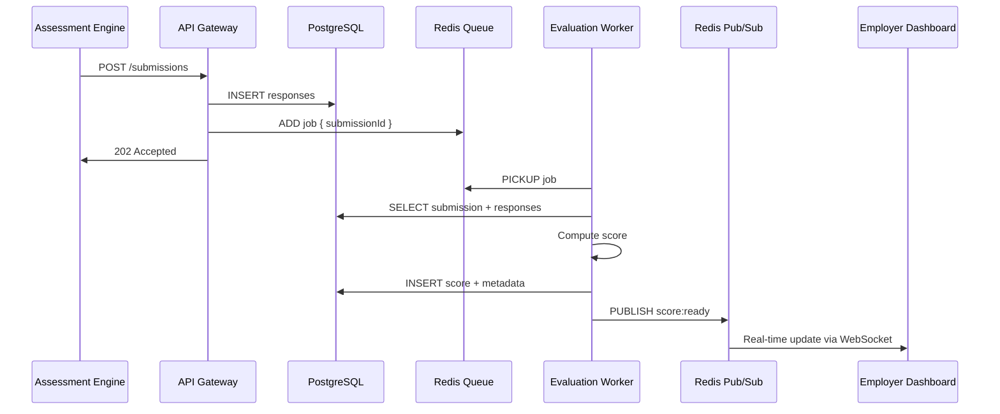
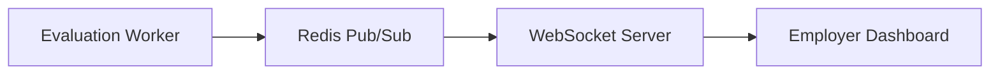

# Zetheta Distributed Task Evaluation Platform — System Plan

## 1. Executive Summary

This document presents the architectural plan for a production-grade distributed candidate evaluation platform. The system enables secure cross-application assessment delivery, asynchronous evaluation processing, and real-time employer insights through a cohesive suite of independent services orchestrated within a unified monorepo.

The design prioritizes:
- **Security**: Cryptographically sound cross-application authentication with short-lived, single-use tokens.
- **Reliability**: Fault-tolerant evaluation pipelines with idempotent processing and graceful degradation.
- **Observability**: Structured logging, error tracking, and performance metrics across all services.
- **Deployability**: Single-command local startup via Docker Compose.

## 2. System Architecture Overview

The platform consists of three frontend applications, three backend services, and two shared infrastructure layers, all organized within a monorepo structure.



### Service Boundaries

| Component | Responsibility |
|-----------|--------------|
| **Candidate Portal** | User authentication and assessment entry point |
| **Assessment Engine** | MCQ rendering, answer collection, and submission trigger |
| **Employer Dashboard** | Real-time candidate funnel visualization and score access |
| **API Gateway** | Unified ingress, request routing, rate limiting, and auth middleware |
| **Auth Service** | Token issuance, signature verification, and session management |
| **Evaluation Worker** | Asynchronous scoring, result persistence, and event publication |

## 3. Technology Stack & Rationale

### Backend Services
- **Node.js with TypeScript**: Type-safe rapid development with extensive ecosystem support.
- **Fastify**: High-performance HTTP framework with low overhead, supporting the `<200 ms` p95 latency target.
- **Prisma ORM**: Type-safe database access, migration management, and query optimization.
- **Zod**: Runtime schema validation for all inbound API payloads.

### Frontend Applications
- **Next.js 14 (App Router)**: Unified framework for server and client rendering across all three applications.
- **TailwindCSS**: Utility-first styling for consistent, rapid UI development.

### Distributed Infrastructure
- **Redis**: Message broker for evaluation jobs, pub/sub channel for real-time updates, and ephemeral token nonce store.
- **BullMQ**: Robust queue management with built-in retry logic, delayed jobs, and worker scaling.

### Database
- **PostgreSQL 15**: ACID-compliant relational storage with strong indexing and JSONB support where needed.

### Observability
- **Pino**: Structured JSON logging with configurable log levels.
- **Prometheus Client**: Custom metrics for API latency histograms, queue depth, and worker throughput.

### Infrastructure & Tooling
- **Docker & Docker Compose**: Reproducible local environment with a single `docker compose up` command.
- **Turborepo with pnpm**: Efficient monorepo task orchestration and dependency management.

## 4. Monorepo Structure

```
zetheta-evaluation-platform/
├── apps/
│   ├── candidate-portal/          # Login & assessment trigger
│   ├── assessment-engine/         # MCQ interface & submission
│   └── employer-dashboard/        # Real-time candidate funnel
├── services/
│   ├── api-gateway/               # Routing, auth middleware, rate limiting
│   ├── auth-service/              # JWT issuance & verification
│   └── evaluation-worker/         # Background scoring pipeline
├── packages/
│   ├── shared-types/              # Cross-service TypeScript contracts
│   ├── shared-config/             # ESLint, Prettier, tsconfig presets
│   └── utils/                     # Common validation & crypto helpers
├── docker-compose.yml
├── turbo.json
└── README.md
```

This structure enforces clear service boundaries while enabling code reuse through shared packages.

## 5. Cross-Application Authentication

The Candidate Portal and Assessment Engine are independently deployed applications. When a candidate initiates an assessment, a secure, server-generated token facilitates the transition without requiring re-authentication.

### Constraints Satisfied

| Constraint | Implementation |
|------------|----------------|
| Server-side generation | Tokens are signed exclusively by the Auth Service using RS256 |
| Short-lived | Expiration fixed at `iat + 60 seconds` |
| Single-use | Redis-backed `jti` nonce is atomically checked and deleted on first use |
| Integrity-guaranteed | RSA signature cryptographically binds token to candidate identity |
| Replay-resistant | Fresh UUID v4 `jti` per request with server-side invalidation |

### Handoff Flow



## 6. Distributed Evaluation Pipeline

Submissions from the Assessment Engine are processed asynchronously to maintain API responsiveness and support fault-tolerant scoring.

### Processing Sequence

1. **Store Submission**: API Gateway persists candidate responses in PostgreSQL.
2. **Publish Event**: A job containing the `submissionId` is enqueued in Redis via BullMQ.
3. **Worker Consumption**: Evaluation Worker picks up the job and fetches the submission.
4. **Score Computation**: Correct answers are tallied against the MCQ key.
5. **Persist Result**: Score, evaluation timestamp, and worker metadata are written to PostgreSQL.
6. **Notify Dashboard**: A completion event is published over Redis Pub/Sub, propagated to the Employer Dashboard via WebSocket.



### Pipeline Design Properties

- **Asynchronous**: The submission endpoint returns `202 Accepted` immediately, decoupling response time from scoring logic.
- **Idempotent**: Unique constraints on `scores.submission_id` and pre-processing existence checks prevent duplicate records.
- **Retry-safe**: BullMQ configured with exponential backoff (`1s → 5s → 15s`) for transient failures.
- **Fault-tolerant**: Redis unavailability triggers graceful degradation with logged retries rather than data loss.

## 7. Data Architecture

### Core Entities

The PostgreSQL schema supports the full assessment lifecycle with the following entities:

- **candidates**: Identity, contact information, authentication credentials, and role assignments.
- **applications**: Links candidates to specific assessment sessions with status tracking.
- **mcq_questions**: Question content, options array, correct answer key, and ordering metadata.
- **responses**: Per-question candidate answers tied to a submission batch.
- **scores**: Computed results with evaluation timestamps and worker instance metadata.

### Indexing Strategy

All hot-path queries are backed by B-tree indexes to eliminate full table scans:

- `candidates(email)` — login lookups
- `applications(candidate_id, status)` — funnel aggregation
- `responses(submission_id)` — worker fetch on evaluation
- `scores(submission_id)` — idempotency check and dashboard join
- `scores(evaluated_at)` — time-range filtering on the dashboard

Detailed schema definitions, relationship diagrams, and constraint specifications are provided in [`schema_design.md`](./schema_design.md).

## 8. Real-Time System

The Employer Dashboard receives live updates through a WebSocket layer bridged to Redis Pub/Sub:



Dashboard clients establish a persistent WebSocket connection on load. When a candidate submits an assessment or an evaluation completes, the corresponding event is pushed to the dashboard without requiring a page refresh.

## 9. Security & Code Quality

### Security Expectations
- No secrets, API keys, or credentials are committed to the repository. All sensitive configuration is injected via environment variables, with a `.env.example` file provided for reference.
- All API endpoints enforce input validation and sanitization via Zod schemas.
- Container images run under a non-root user.
- Dependencies are pinned and audited (`npm audit`) with findings documented.

### Code Quality Expectations
- **Linting & Formatting**: ESLint and Prettier are configured at the monorepo root and enforced in CI.
- **Testing**: Unit tests for business logic and integration tests for API contracts and pipeline end-to-end flows.
- **Commit Hygiene**: Atomic commits following the Conventional Commits specification (`feat:`, `fix:`, `docs:`, `test:`).

## 10. Observability

### Structured Logging
All services emit JSON-structured logs via Pino with consistent fields:
- `level`, `timestamp`, `service`, `requestId`, `message`, `error` (when applicable)

### Metrics
- **API Gateway**: Request latency histogram (p95 target `< 200 ms`), throughput, and error rate.
- **Evaluation Worker**: Job processing duration, queue depth, success rate, and retry count.
- **Auth Service**: Token issuance rate and validation failure rate.

### Error Tracking
Uncaught exceptions are captured with full stack traces, request context, and correlated request IDs for rapid diagnosis.

## 11. Performance Targets

| Target | Metric | Mitigation Strategy |
|--------|--------|---------------------|
| API Latency | `< 200 ms` at p95 | Fastify, indexed queries, minimal payload sizes |
| Database | Zero full table scans on hot paths | Strategic B-tree indexes on all query keys |
| Real-time | Sub-second dashboard updates | WebSocket + Redis Pub/Sub with in-memory broadcasting |
| Worker Throughput | Scales horizontally | Stateless workers consuming from a shared queue |

## 12. Deployment Strategy

The local development and evaluation environment is fully containerized using Docker Compose. A single `docker compose up --build` command starts:

- PostgreSQL instance with persistent volume
- Redis instance for queues and pub/sub
- All three backend services
- All three frontend applications (served via Next.js or nginx in production-like mode)
- Evaluation Worker instances (horizontally scalable via `--scale`)

Detailed service topology, dependency order, health checks, and environment variable mappings are provided in [`deployment_design.md`](./deployment_design.md).

## 13. Risk Assessment & Mitigation

| Risk | Impact | Mitigation |
|------|--------|------------|
| Redis outage | Pipeline stalls, real-time updates fail | Jobs retry with exponential backoff; API falls back to synchronous status polling |
| Worker crash | Score computation delayed | BullMQ re-queues unacknowledged jobs for redelivery |
| Duplicate submission events | Duplicate score records | Idempotency via unique `scores.submission_id` constraint |
| Token replay | Unauthorized assessment access | Redis `jti` single-use enforcement with atomic GET-DEL |
| Database performance degradation | API latency exceeds target | Comprehensive indexing; query review via Prisma query logs |

## 14. Task Breakdown & Approach

1. **Infrastructure Setup**: Initialize monorepo, configure Turborepo, Docker Compose, and shared packages.
2. **Database & Schema**: Define Prisma schema, run migrations, and verify index coverage.
3. **Auth Service**: Implement RS256 token issuance and verification with Redis nonce storage.
4. **API Gateway**: Build routing layer, auth middleware, and submission endpoints.
5. **Candidate Portal & Assessment Engine**: Implement UI flows and cross-app redirect.
6. **Evaluation Pipeline**: Configure BullMQ, implement worker logic, and guarantee idempotency.
7. **Employer Dashboard**: Build funnel UI and WebSocket integration.
8. **Observability & Testing**: Add structured logging, metrics, unit tests, and integration tests.
9. **Security Audit & Documentation**: Run dependency audit, finalize README, and write retrospective.

---

*This plan is committed as the foundational design document before any implementation code is introduced, in accordance with the assignment requirements.*
